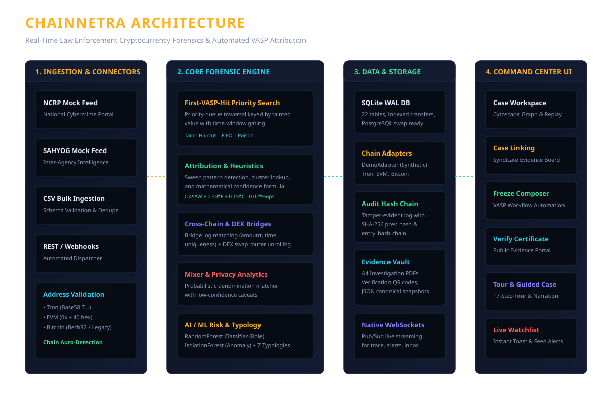

# ChainNetra (चेन-नेत्र) 👁️
### Real-Time Cryptocurrency Fraud Attribution & Automated VASP Identification Platform

[](https://fastapi.tiangolo.com/)
[](https://react.dev/)
[](https://js.cytoscape.org/)
[](https://scikit-learn.org/)

> **One-Line Mission**: Turn a days-long expert tracing task into a minutes-long automated one so proceeds of cybercrime can be frozen at exchanges before they disappear.

---

## 📸 Architecture & Overview



ChainNetra ("Netra" = Eye) is an automated blockchain forensics command room tailored for Law Enforcement Agencies (LEAs), State Cyber Cells, and Financial Intelligence Units (FIU-IND). Taking reported suspect cryptocurrency addresses from victim complaints (via simulated NCRP / SAHYOG feeds), ChainNetra automatically traces multi-chain fund flows, isolates intermediary layering burner wallets, identifies the nearest Virtual Asset Service Provider (VASP / Exchange) deposit address, predicts laundering typologies via ML, automates freeze notices, and certifies evidence with cryptographic hash chains.

---

## ⚡ Key Capabilities

- **Automated Multi-Chain First-VASP-Hit Tracing**: Priority-queue graph traversal keyed by `(chain, address)` composite nodes across Tron, Bitcoin, Ethereum, BSC, Polygon, and Arbitrum with multi-root EVM expansion.
- **Asynchronous Task Processing with `arq` & Redis**: Case tracing jobs execute asynchronously via `arq` worker queue with exponential backoff retries, stuck-job sweepers, and live WebSocket progress streams.
- **Rigorous Multi-Chain Address Validation**: Cryptographic checksum validation across Tron Base58Check (`0x41`), Bitcoin (Base58Check & Bech32/Bech32m), and EVM EIP-55 with chain hint override audits.
- **Automated Threat Intelligence Ingestion**: Streamed ingestion of OFAC SDN sanctions lists, FIU-IND registered VASP directories, and verified exchange reserve addresses with conflict-weighted tiering.
- **Contract-First Complaint Ingestion Pipeline**: Ingests victim complaints via Mock NCRP connector, folder drop watcher (`/data/drop`), and HMAC-SHA256 authenticated REST endpoints with timestamp skew protection.
- **Relational Cross-Complaint Linking & Deduplication**: High-speed relational indexing via `complaint_wallets` identifying multi-complaint suspect syndicates and raising automated linkage alerts.
- **Complainant PII Protection at Rest**: Symmetric Fernet encryption of victim contact identifiers (`victim_ref`); unmasked strictly for supervisor and administrator roles.
- **Background Watchlist Monitor & Alert Lifecycle**: Scheduled watcher tracking monitored wallets for sanctions hits (`Critical`), mixer interactions (`High`), VASP movements (`High`), and new inflows (`Medium`) with deduplication.
- **Thread-Safe Locked Sequence Counters**: Concurrency-safe sequence counters (`SystemCounter`) replacing count-based race conditions for cases, complaints, and freeze orders.
- **Stateful Per-Wallet Taint Propagation**: Chronologically replayed wallet ledgers supporting Haircut (proportional allocation), FIFO (first-in first-out lot queues), and Poison (bounded contamination) with mathematical conservation invariants.
- **Temporally Sound Lookahead Windows**: Strict `since` and `until` bounded traversal anchored to tainted fund arrival timestamps, preventing reverse-chronological false paths.
- **Generalized Peel-Chain Detection**: Detection of $n$-output peeling chains requiring $\ge 3$ consecutive hops carrying $\ge 80\%$ tainted value.
- **Evidence-Based Dynamic Attribution**: Mathematical confidence scoring ($0.45 \cdot W_{label} + 0.30 \cdot E_{strength} + 0.15 \cdot C_{cluster} - 0.02 \cdot Hops$) with label age decay, concrete evidence facts, and tiered confidence levels (`VERIFIED`, `HIGH`, `MEDIUM`, `LOW`).
- **4-Point Multi-Sweep Deposit Heuristic**: Distinguishes true exchange deposit addresses ($\ge 3$ distinct senders, $\ge 90\%$ swept to hot wallet, consistent multi-sweep timing) from one-off mule senders.
- **Service-Aware Clustering & UTXO Heuristics**: 24-hour SQL aggregated sweeps excluding service hot wallets, Bitcoin common-input ownership with CoinJoin exclusion, and fresh-wallet gas-funding dispersal tracking.
- **Curated Service Registry & Cross-Chain Routing**: Curated directory for mixers, cross-chain bridges, DEX routers, and VASPs; token-aware bridge candidate matching with ambiguity scoring; and probabilistic mixer withdrawal branching ($\le 40\%$ confidence cap).
- **AI / ML Risk & Typology Engine**: Random Forest wallet role classification, Isolation Forest anomaly scoring, and weighted rule matching across 7 fraud typologies (Pig-butchering, Task fraud, Sextortion, Ransomware, Phishing drainers, Darknet, Layering syndicates).
- **Syndicate Convergence (Case Linking)**: Interactive evidence board linking disparate victim complaints across states converging onto shared collector clusters.
- **Statutory Freeze Notice Composer**: Auto-populated freeze requests with transaction hashes, SLA countdowns, and multi-stage approval workflows (Draft $\rightarrow$ Supervisor Approval $\rightarrow$ Outbound Dispatch $\rightarrow$ Frozen).
- **Court-Ready PDF Reports & QR Verification**: A4 PDF investigation summaries with canonical JSON snapshots, SHA-256 integrity digests, and a public `/verify` portal.
- **Cryptographic Hash-Chained Audit Log**: Every investigative action is linked in a tamper-evident hash chain (`prev_hash` + `entry_hash`), preventing internal evidence tampering.
- **Dual Operating Modes**:
  - `DEMO MODE`: Fully functional offline deterministic dataset seeded with 6 realistic cybercrime scenarios, 65 historic cases, and 8 VASPs.
  - `LIVE MODE`: Connects to public blockchain RPCs and explorers (TronGrid, Etherscan family, Blockstream Esplora) with automatic caching and circuit-breaker fallback.

---

## 🛠️ Technology Stack

| Layer | Technologies |
| :--- | :--- |
| **Frontend** | React 18, TypeScript, Vite, Tailwind CSS, Cytoscape.js (`cytoscape-fcose`), Recharts, Framer Motion, Driver.js, Zustand, TanStack Query |
| **Backend** | Python 3.11+, FastAPI, Uvicorn, SQLAlchemy 2 (Postgres / SQLite), Alembic, NetworkX, Native WebSockets |
| **Queue & Cache** | Redis 7, `arq` Asynchronous Task Queue & Cron Scheduler, In-Memory Token Bucket Rate Limiting |
| **Intelligence & ML** | Scikit-learn (RandomForest, IsolationForest), NumPy, Pandas, Joblib |
| **Evidence & Integrity** | ReportLab (A4 PDF), QRCode, SHA-256 Hash Chaining, HMAC-SHA256 Webhooks & REST Ingest |

---

## 🚀 Quickstart & Setup

### Prerequisites
- Python 3.11+
- Node.js 18+ & npm
- Git

### Option A: Cross-Platform Bootstrap (Windows / Linux / macOS)

Using the cross-platform orchestrator:

```bash
# 1. Setup virtual environment and dependencies
python scripts/dev.py setup
# Or on Linux/macOS: make setup
# Or on Windows PowerShell: .\scripts\dev.ps1 setup

# 2. Seed database
python scripts/dev.py seed
# Or: make seed

# 3. Start backend & frontend together
python scripts/dev.py dev
# Or: make dev
# Or: .\scripts\dev.ps1 dev
```

Open **`http://localhost:5173`** in your browser.

---

### Option B: Docker Compose

```bash
docker compose up --build
```
- Frontend UI: `http://localhost:5173`
- Backend API Docs: `http://localhost:8000/docs`

---

## 🔐 Demo Credentials

In Demo Mode, pre-seeded accounts are provided on the login screen:
- **Investigator**: `investigator@demo` / `demo123` (Tracing, Cases, Reports)
- **Supervisor**: `supervisor@demo` / `demo123` (Freeze Approval, Analytics, Audits)
- **Administrator**: `admin@demo` / `demo123` (Label Management, API Keys, System Settings)

---

## 🧪 Testing & Hygiene Checks

Run complete test suite, legal provisions integrity check, and frontend host hygiene guard:

```bash
# Run pytest test suite
python scripts/dev.py test
# Or: make test

# Run all guards (lint, legal strings, no hardcoded hosts)
python scripts/dev.py lint
# Or: make lint

# Complete check (lint + test)
python scripts/dev.py check
# Or: make check
```

---

## ⚖️ Limitations & Production Roadmap

- **Attribution Inference**: Address attribution constitutes mathematical and behavioral evidence-based inference, not absolute legal proof.
- **Mixer / Privacy Coins**: Tracing through privacy pools uses probabilistic denomination and time-delta matching with explicit confidence caveats.
- **Enterprise Scaling**: For production deployments handling nationwide scale, SQLite seamlessly transitions to PostgreSQL + ClickHouse / Neo4j via SQLAlchemy, and WebSockets integrate with Apache Kafka for millions of real-time transactions.

---

## 📄 License
License decision pending owner confirmation (neither `license` nor `license_holder` specified in `docs/research/decisions.md`). Developed for Smart India Hackathon (SIH).
